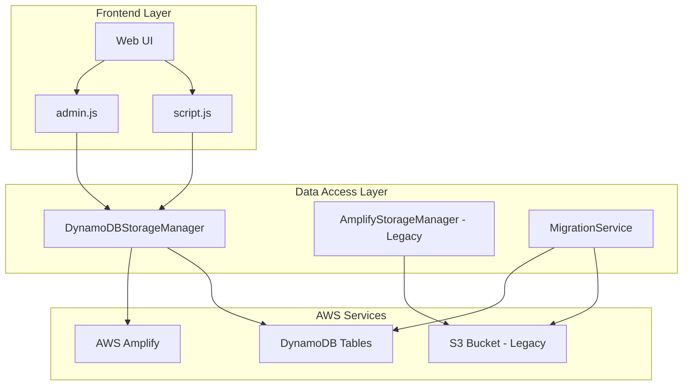

# Design Document

## Overview

이 설계는 현재 S3 기반 JSON 파일 저장 방식을 AWS DynamoDB NoSQL 데이터베이스로 마이그레이션하는 시스템을 다룹니다. DynamoDB는 AWS Amplify와 완벽하게 통합되며, 높은 성능과 확장성을 제공합니다. 기존 사용자 경험을 유지하면서 더 효율적인 데이터 관리를 가능하게 합니다.

## Architecture

### High-Level Architecture



### Data Flow

1. **읽기 작업**: Frontend → DynamoDBStorageManager → DynamoDB → Response
2. **쓰기 작업**: Frontend → DynamoDBStorageManager → DynamoDB → Confirmation
3. **마이그레이션**: S3 Data → MigrationService → DynamoDB Tables

## Components and Interfaces

### 1. DynamoDBStorageManager Class

기존 `AmplifyStorageManager`를 대체하는 새로운 클래스입니다.

```javascript
class DynamoDBStorageManager {
    constructor()
    
    // Core CRUD Operations
    async loadMembers()
    async saveMembers(members)
    async loadRecords()
    async saveRecords(records)
    async loadSchedules()
    async saveSchedules(schedules)
    
    // Individual Item Operations
    async addMember(member)
    async updateMember(memberId, updates)
    async deleteMember(memberId)
    async addRecord(record)
    async updateRecord(recordId, updates)
    async deleteRecord(recordId)
    async addSchedule(schedule)
    async updateSchedule(scheduleId, updates)
    async deleteSchedule(scheduleId)
    
    // Query Operations
    async getMemberRecords(memberId)
    async getRecordsByDateRange(startDate, endDate)
    async getSchedulesByMonth(year, month)
    
    // Utility Operations
    async checkConnection()
    async withRetry(operation, maxRetries)
    handleDynamoDBError(error, operation, tableName)
}
```

### 2. MigrationService Class

S3에서 DynamoDB로 데이터를 마이그레이션하는 서비스입니다.

```javascript
class MigrationService {
    constructor(s3Manager, dynamoManager)
    
    async migrateAllData()
    async migrateMembers()
    async migrateRecords()
    async migrateSchedules()
    async validateMigration()
    async createBackupBeforeMigration()
}
```

### 3. DynamoDB Table Configurations

#### Members Table
- **Table Name**: `RunningClub-Members`
- **Partition Key**: `id` (Number)
- **Attributes**:
  - `id`: Number (Primary Key)
  - `name`: String
  - `totalDistance`: Number
  - `recordCount`: Number
  - `joinDate`: String
  - `createdAt`: String (ISO timestamp)
  - `updatedAt`: String (ISO timestamp)

#### Records Table
- **Table Name**: `RunningClub-Records`
- **Partition Key**: `id` (Number)
- **Global Secondary Index**: `memberId-date-index`
  - Partition Key: `memberId` (Number)
  - Sort Key: `originalDate` (String)
- **Attributes**:
  - `id`: Number (Primary Key)
  - `memberId`: Number
  - `distance`: Number
  - `pace`: String (nullable)
  - `date`: String (formatted date)
  - `time`: String
  - `originalDate`: String (ISO date for sorting)
  - `createdAt`: String (ISO timestamp)
  - `updatedAt`: String (ISO timestamp)

#### Schedules Table
- **Table Name**: `RunningClub-Schedules`
- **Partition Key**: `id` (Number)
- **Global Secondary Index**: `date-index`
  - Partition Key: `date` (String)
- **Attributes**:
  - `id`: Number (Primary Key)
  - `date`: String (YYYY-MM-DD format)
  - `time`: String
  - `location`: String
  - `description`: String (nullable)
  - `createdAt`: String (ISO timestamp)
  - `updatedAt`: String (ISO timestamp)

## Data Models

### Member Model
```javascript
{
    id: Number,           // Unique identifier
    name: String,         // Member name
    totalDistance: Number, // Total distance in km
    recordCount: Number,  // Number of records
    joinDate: String,     // Join date in Korean format
    createdAt: String,    // ISO timestamp
    updatedAt: String     // ISO timestamp
}
```

### Record Model
```javascript
{
    id: Number,           // Unique identifier
    memberId: Number,     // Reference to member
    distance: Number,     // Distance in km
    pace: String|null,    // Pace in MM:SS format
    date: String,         // Formatted date (Korean)
    time: String,         // Time of record entry
    originalDate: String, // ISO date for sorting
    createdAt: String,    // ISO timestamp
    updatedAt: String     // ISO timestamp
}
```

### Schedule Model
```javascript
{
    id: Number,           // Unique identifier
    date: String,         // Date in YYYY-MM-DD format
    time: String,         // Time in HH:MM format
    location: String,     // Location name
    description: String|null, // Optional description
    createdAt: String,    // ISO timestamp
    updatedAt: String     // ISO timestamp
}
```

## Error Handling

### Error Types and Responses

1. **Connection Errors**
   - DynamoDB service unavailable
   - Network connectivity issues
   - AWS credential problems

2. **Data Validation Errors**
   - Invalid data format
   - Missing required fields
   - Data type mismatches

3. **Business Logic Errors**
   - Duplicate member names
   - Invalid date ranges
   - Referential integrity violations

### Error Handling Strategy

```javascript
class DynamoDBErrorHandler {
    static handleError(error, operation, context) {
        switch (error.code) {
            case 'ResourceNotFoundException':
                return '테이블을 찾을 수 없습니다. 관리자에게 문의하세요.';
            case 'ValidationException':
                return '입력 데이터가 올바르지 않습니다.';
            case 'ProvisionedThroughputExceededException':
                return '요청이 너무 많습니다. 잠시 후 다시 시도해주세요.';
            case 'NetworkingError':
                return '네트워크 연결을 확인해주세요.';
            default:
                return `${operation} 중 오류가 발생했습니다.`;
        }
    }
}
```

## Testing Strategy

### Unit Testing
- DynamoDBStorageManager 클래스의 모든 메서드
- MigrationService의 데이터 변환 로직
- 오류 처리 시나리오

### Integration Testing
- DynamoDB 테이블과의 실제 연결
- Amplify 인증과의 통합
- 프론트엔드와 백엔드 간의 데이터 흐름

### Migration Testing
- S3 데이터의 정확한 변환
- 데이터 무결성 검증
- 롤백 시나리오

### Performance Testing
- 대량 데이터 처리 성능
- 동시 사용자 처리 능력
- 응답 시간 측정

## Migration Strategy

### Phase 1: Preparation
1. DynamoDB 테이블 생성
2. 새로운 DynamoDBStorageManager 구현
3. 마이그레이션 도구 개발

### Phase 2: Data Migration
1. 현재 S3 데이터 백업
2. S3에서 DynamoDB로 데이터 이전
3. 데이터 무결성 검증

### Phase 3: Application Update
1. 프론트엔드 코드 업데이트
2. 기존 S3 코드를 DynamoDB 코드로 교체
3. 철저한 테스트 수행

### Phase 4: Deployment
1. 새로운 버전 배포
2. 실시간 모니터링
3. 필요시 롤백 준비

## Amplify Configuration Updates

### amplify_outputs.json 업데이트
```json
{
  "version": "1",
  "storage": {
    "aws_region": "ap-northeast-1",
    "bucket_name": "agrace-run-data"
  },
  "data": {
    "aws_region": "ap-northeast-1",
    "url": "https://dynamodb.ap-northeast-1.amazonaws.com",
    "api_key": "",
    "default_authorization_type": "AWS_IAM",
    "authorization_types": ["AWS_IAM"]
  },
  "auth": {
    "aws_region": "ap-northeast-1",
    "user_pool_id": "",
    "user_pool_client_id": "",
    "identity_pool_id": "",
    "allow_guest_access": true
  }
}
```

## Performance Considerations

### Read Optimization
- GSI를 활용한 효율적인 쿼리
- 페이지네이션 구현
- 캐싱 전략 (필요시)

### Write Optimization
- 배치 쓰기 작업 활용
- 조건부 쓰기로 데이터 일관성 보장
- 트랜잭션 사용 (필요시)

### Cost Optimization
- On-Demand 요금제 사용
- 불필요한 인덱스 최소화
- 데이터 압축 고려

## Security Considerations

### Access Control
- AWS IAM 역할 기반 접근 제어
- 최소 권한 원칙 적용
- Guest 사용자 권한 제한

### Data Protection
- 전송 중 암호화 (HTTPS)
- 저장 시 암호화 (DynamoDB 기본 제공)
- 민감 데이터 마스킹

## Monitoring and Logging

### CloudWatch Metrics
- 읽기/쓰기 용량 사용률
- 오류율 모니터링
- 응답 시간 추적

### Application Logging
- 모든 DynamoDB 작업 로깅
- 오류 상세 정보 기록
- 사용자 행동 추적

## Rollback Strategy

### 롤백 조건
- 데이터 무결성 문제 발견
- 성능 저하 발생
- 사용자 경험 악화

### 롤백 절차
1. 트래픽을 이전 S3 기반 시스템으로 전환
2. DynamoDB 데이터를 S3로 백업
3. 문제 해결 후 재배포